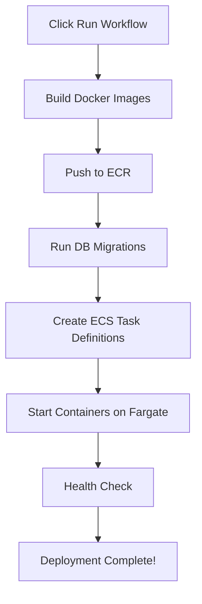

# 🚀 Deploy MegiLance Application NOW

## Current Status
✅ **Infrastructure COMPLETE** (Workflow #37 SUCCESS)
- VPC, Subnets, NAT Gateway ✅
- RDS PostgreSQL Database ✅
- ECR Repositories (empty) ✅
- S3 Buckets ✅
- IAM Roles ✅
- ECS Cluster (empty) ✅

⚠️ **Application NOT DEPLOYED YET**
- No Docker images built
- No containers running on ECS
- Backend/Frontend NOT accessible

## What's Missing?

The infrastructure workflow (`infrastructure.yml`) created all AWS resources (VPC, RDS, ECR, etc.) but it **DOES NOT deploy the application containers**.

You need to run the **second workflow** to:
1. Build Docker images for backend and frontend
2. Push images to ECR
3. Create ECS task definitions
4. Start containers on ECS Fargate
5. Run database migrations
6. Configure health checks

## ⚡ Quick Deploy (3 Steps - 15 Minutes)

### Step 1: Go to GitHub Actions
```
https://github.com/ghulam-mujtaba5/MegiLance/actions/workflows/auto-deploy.yml
```

Or manually:
1. Open https://github.com/ghulam-mujtaba5/MegiLance
2. Click **"Actions"** tab at the top
3. In left sidebar, click **"Build and Deploy Application"**

### Step 2: Run the Workflow
1. Click **"Run workflow"** button (top right, next to "This workflow has a workflow_dispatch event trigger")
2. A dropdown will appear with options:
   - **Deployment environment**: Select `production`
   - **Deploy backend**: Keep checked ✅
   - **Deploy frontend**: Keep checked ✅
3. Click **"Run workflow"** (green button at bottom of dropdown)

### Step 3: Wait & Verify
- Workflow takes **~15 minutes** to complete
- You'll see 6 jobs running:
  1. ⏳ Build & Push Backend (builds Docker image, pushes to ECR)
  2. ⏳ Build & Push Frontend (builds Docker image, pushes to ECR)
  3. ⏳ Run Database Migrations (creates database tables)
  4. ⏳ Deploy Backend to ECS (starts backend containers)
  5. ⏳ Deploy Frontend to ECS (starts frontend containers)
  6. ⏳ Run Smoke Tests (verifies deployment)

When all 6 jobs show ✅, your application is **LIVE**!

## 📊 After Deployment - Verify

### Check ECS Services
1. Go to AWS Console → ECS → Clusters
2. Click `megilance-cluster`
3. You should see:
   - `megilance-backend-service` - Running: 1/1 tasks
   - `megilance-frontend-service` - Running: 1/1 tasks

### Get Backend URL
1. In ECS cluster, click `megilance-backend-service`
2. Click **Tasks** tab
3. Click the running task
4. Under **Network**, copy **Public IP**
5. Test API:
   ```bash
   curl http://PUBLIC_IP:8000/api/health/live
   # Expected: {"status":"healthy"}
   
   curl http://PUBLIC_IP:8000/api/docs
   # Opens API documentation
   ```

### Check Logs
1. AWS Console → CloudWatch → Log groups
2. Find `/ecs/megilance-backend`
3. Click latest log stream
4. You should see application startup logs

## 🔧 Troubleshooting

### Workflow Fails on "Build Backend"
- **Problem**: Docker build errors
- **Solution**: Check backend/Dockerfile exists
- **Command**: `git pull` to ensure latest code

### Workflow Fails on "Database Migrations"
- **Problem**: Can't connect to RDS
- **Solution**: Check TF_VAR_db_password secret is set correctly
- **Fix**: GitHub Settings → Secrets → Actions → Edit `TF_VAR_db_password`

### Workflow Fails on "Deploy to ECS"
- **Problem**: ECS service doesn't exist yet
- **Solution**: First deployment creates it automatically
- **Note**: This is normal, workflow will create the service

### Tasks Start Then Stop Immediately
- **Problem**: Application crashes on startup
- **Solution**: Check CloudWatch logs
- **Common causes**:
  - Database connection failed
  - Missing secrets
  - Port already in use

## 💡 What Happens During Deployment?



### Detailed Steps:

1. **Build Backend Docker Image**
   - Uses `backend/Dockerfile`
   - Installs Python dependencies
   - Tags: `<commit-sha>` and `latest`

2. **Build Frontend Docker Image**
   - Uses `frontend/Dockerfile`
   - Builds Next.js production build
   - Tags: `<commit-sha>` and `latest`

3. **Push Images to ECR**
   - Backend → `789406175220.dkr.ecr.us-east-2.amazonaws.com/megilance-backend`
   - Frontend → `789406175220.dkr.ecr.us-east-2.amazonaws.com/megilance-frontend`

4. **Run Database Migrations**
   - Connects to RDS PostgreSQL
   - Runs Alembic migrations
   - Creates all tables (users, projects, proposals, etc.)

5. **Create Task Definitions**
   - Defines container specs (CPU: 512, Memory: 1024MB)
   - Configures environment variables
   - Sets up health checks
   - Links to IAM roles

6. **Deploy to ECS**
   - Creates ECS services (if not exist)
   - Starts Fargate tasks
   - Attaches to load balancer (if configured)
   - Monitors health checks

7. **Smoke Tests**
   - Tests `/api/health/live`
   - Tests `/api/health/ready`
   - Tests `/api/docs`
   - Verifies database connectivity

## 🎯 Success Indicators

After workflow completes, you should have:

✅ **ECR Repositories**
- `megilance-backend:latest` image exists
- `megilance-backend:<commit-sha>` image exists
- `megilance-frontend:latest` image exists
- `megilance-frontend:<commit-sha>` image exists

✅ **ECS Cluster**
- `megilance-cluster` exists
- 2 services running
- 2 tasks running (1 backend, 1 frontend)

✅ **Database**
- RDS instance status: Available
- All tables created
- Migrations at head revision

✅ **API Accessible**
- `http://<BACKEND_IP>:8000/api/health/live` returns 200
- `http://<BACKEND_IP>:8000/api/docs` shows Swagger UI
- `http://<BACKEND_IP>:8000/api/v1/auth/health` returns 200

✅ **Logs**
- CloudWatch logs flowing
- No error messages
- Application started successfully

## 🚨 Common Issues

### Issue: "Role not found: megilance-exec-role"
**Cause**: Infrastructure workflow didn't complete
**Fix**: Re-run infrastructure workflow first

### Issue: "Repository does not exist: megilance-backend"
**Cause**: ECR repositories not created
**Fix**: Check infrastructure workflow completed successfully

### Issue: "Secret not found: megilance/prod/database"
**Cause**: Secrets Manager entries not created
**Fix**: Verify TF_VAR_db_password secret in GitHub

### Issue: "Task failed to start"
**Cause**: Usually container crashes on startup
**Fix**:
1. Check CloudWatch logs: `/ecs/megilance-backend`
2. Look for Python errors
3. Verify DATABASE_URL is correct
4. Check all required secrets exist

## 📈 Next Steps After Deployment

### Immediate (5 minutes):
- [ ] Test all API endpoints via Swagger UI
- [ ] Verify database has tables
- [ ] Check logs for any warnings
- [ ] Test authentication flow

### Short-term (1 hour):
- [ ] Configure domain name (Route 53)
- [ ] Add SSL certificate (ACM)
- [ ] Set up Application Load Balancer
- [ ] Configure HTTPS listeners

### Medium-term (1 day):
- [ ] Set up CloudWatch alarms
- [ ] Configure auto-scaling
- [ ] Enable automated backups
- [ ] Add WAF rules

### Long-term (1 week):
- [ ] Implement CI/CD for automatic deployments
- [ ] Set up staging environment
- [ ] Configure monitoring dashboards
- [ ] Document operational runbooks

## 💰 Cost Estimate

After deployment, you'll have:

| Resource | Configuration | Monthly Cost |
|----------|--------------|--------------|
| ECS Fargate (Backend) | 0.5 vCPU, 1GB RAM | ~$15 |
| ECS Fargate (Frontend) | 0.25 vCPU, 0.5GB RAM | ~$7 |
| RDS PostgreSQL | db.t3.micro | ~$15 |
| NAT Gateway | 1 instance | ~$32 |
| Data Transfer | ~10GB | ~$1 |
| CloudWatch Logs | 5GB | ~$3 |
| **Total** | | **~$73/month** |

*Prices may vary by region and usage patterns*

## 🔒 Security Notes

**IMPORTANT**: After deployment:
1. ✅ Rotate any exposed AWS access keys immediately
2. ✅ Use strong database passwords (16+ characters)
3. ✅ Enable MFA on AWS root account
4. ✅ Review security group rules
5. ✅ Enable AWS CloudTrail for audit logs

## 📞 Need Help?

### Check These First:
1. **GitHub Actions Logs**: See exact error messages
2. **CloudWatch Logs**: Application runtime errors
3. **ECS Task Events**: Container start/stop reasons
4. **RDS Connectivity**: Test from ECS task

### Useful Commands:

```bash
# Check ECS services status
aws ecs describe-services \
  --cluster megilance-cluster \
  --services megilance-backend-service \
  --region us-east-2

# Check running tasks
aws ecs list-tasks \
  --cluster megilance-cluster \
  --region us-east-2

# View recent logs
aws logs tail /ecs/megilance-backend --follow --region us-east-2

# Check ECR images
aws ecr describe-images \
  --repository-name megilance-backend \
  --region us-east-2
```

---

## 🎉 Ready to Deploy?

**Go to**: https://github.com/ghulam-mujtaba5/MegiLance/actions/workflows/auto-deploy.yml

**Click**: "Run workflow" → Select "production" → Click "Run workflow"

**Wait**: 15 minutes

**Celebrate**: Your MegiLance platform is LIVE! 🚀

---

**Questions?** Check the logs first:
- GitHub Actions: Workflow execution logs
- CloudWatch: Application runtime logs
- ECS Console: Container status and events
