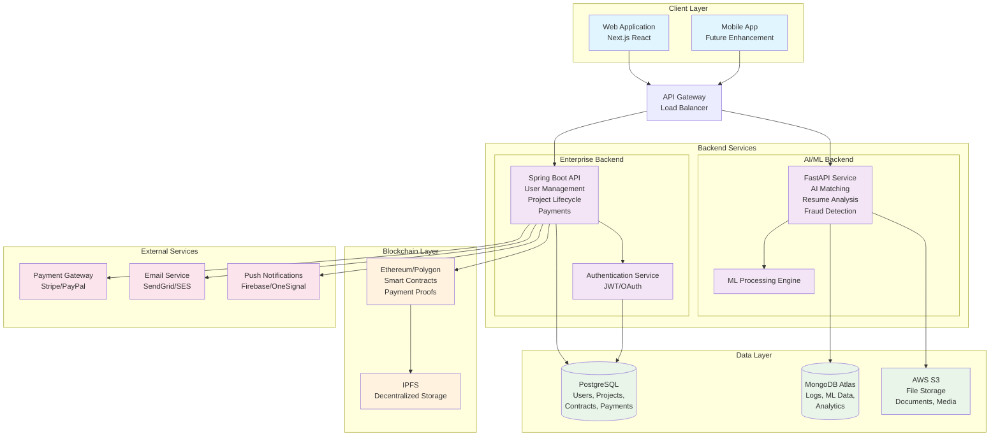
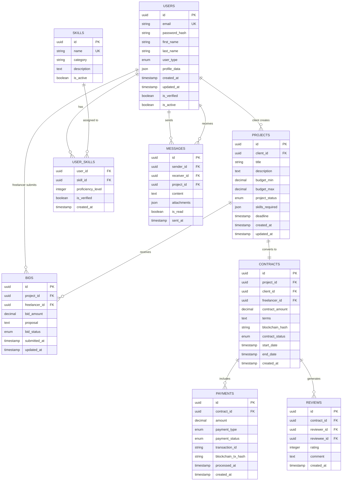
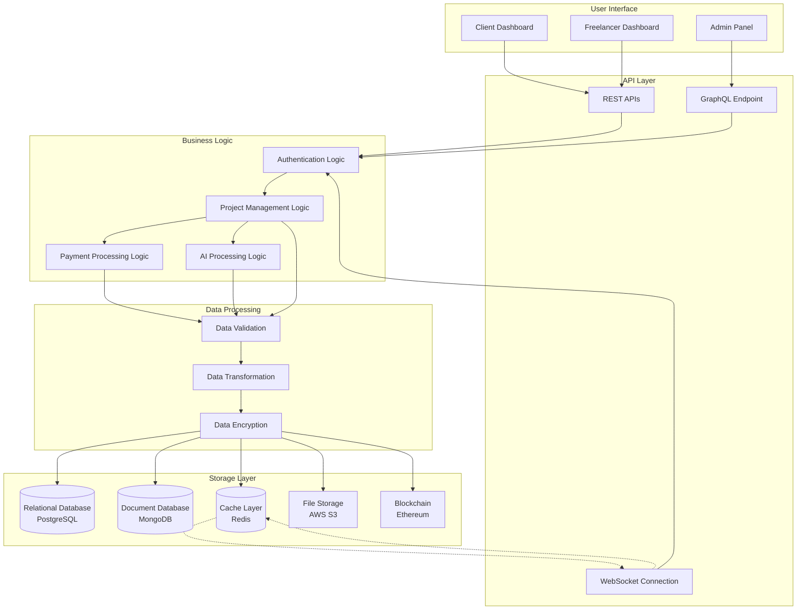
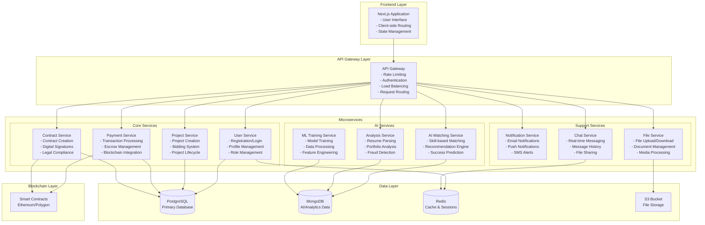

# Notice: This file is deprecated

This preview has been consolidated. Please use the canonical doc: `docs/SystemArchitectureDiagrams.md`.

---

# MegiLance System Diagrams Preview

This file contains all the key diagrams from your system architecture documentation for easy viewing in VS Code.

---

## 1. High-Level System Architecture

---

## 2. Database Schema (Entity Relationship Diagram)

---

## 3. Data Flow Architecture

---

## 4. Microservices Architecture

---

## 5. CI/CD Pipeline Architecture

```mermaid
flowchart LR
    subgraph "Source Control"
        GitHub[GitHub Repository]
        Branches[Feature Branches]
    end

    subgraph "CI Pipeline"
        Trigger[Webhook Trigger]
        Build[Build Process]
        Test[Automated Testing]
        Security[Security Scanning]
        Quality[Code Quality Check]
    end

    subgraph "Artifact Management"
        Registry[Container Registry]
        S3Artifacts[S3 Artifact Storage]
    end

    subgraph "CD Pipeline"
        Dev[Development Environment]
        Staging[Staging Environment]
        Prod[Production Environment]
    end

    subgraph "Deployment"
        Infrastructure[Infrastructure as Code]
        Containers[Container Orchestration]
        Database[Database Migration]
        Configuration[Configuration Management]
    end

    subgraph "Monitoring"
        HealthCheck[Health Checks]
        Metrics[Performance Metrics]
        Alerts[Alert System]
        Rollback[Automatic Rollback]
    end

    %% Flow
    GitHub --> Trigger
    Branches --> Trigger
    Trigger --> Build
    Build --> Test
    Test --> Security
    Security --> Quality
    Quality --> Registry
    Quality --> S3Artifacts
    
    Registry --> Dev
    Dev --> Staging
    Staging --> Prod
    
    Prod --> Infrastructure
    Infrastructure --> Containers
    Containers --> Database
    Database --> Configuration
    
    Configuration --> HealthCheck
    HealthCheck --> Metrics
    Metrics --> Alerts
    Alerts --> Rollback
```

---

## How to View These Diagrams in VS Code:

1. Prefer opening the canonical doc: `docs/SystemArchitectureDiagrams.md` in VS Code
2. **Press `Ctrl+Shift+V`** to open Markdown Preview
3. **All diagrams will render beautifully** in the preview pane
4. You can also **right-click** on any diagram and select "Copy as Image" for presentations

## For Individual Diagrams:
- Open any of the documentation files (SystemArchitectureDiagrams.md, DatabaseDesignSpecs.md, etc.)
- Use Markdown Preview (`Ctrl+Shift+V`) to see all diagrams rendered

The Mermaid extension is already installed, so all diagrams should render perfectly! 🎉